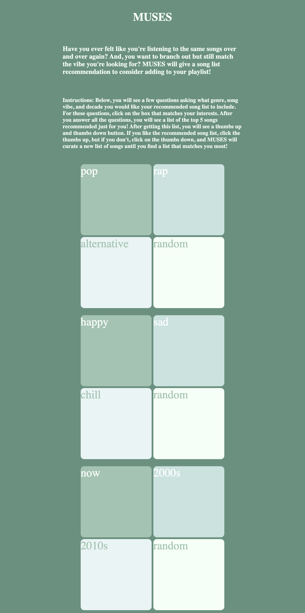

# User Interface

## Data Interactions
- MUSES will provide a song list recommendation based on user input. 
- Before giving a recommendation, the user will be asked a few questions, such as the genre, song vibe, and decade. 
- With this information, MUSES will present the top 5 songs that meet the user's criteria. 
- After the recommendation is given, the user will be asked if they like or dislike the list. 
- If they dislike the list, a new list would be created with five new songs until they like the recommendation list.

## HTML Page

As seen on the HTML page, there are four main sections:

1. At the top, we have the title for the web application called MUSES.
2. Right below the title is a short description of MUSES's purpose and what the user can gain from using the application.
3. Under the description are the instructions for how the user would use MUSES, selecting the boxes that match their interests.
4. Below the description are four sets of boxes representing what the user will select, such as the genre, song vibe, and decade.

Based on the user's selections, the recommended song list and the like and dislike buttons will pop up. 

## Application Demo
[MUSES Application Demo](https://github.com/soniyagaikwad/cs326-project-son.i.ya/raw/35c7fca8d2f60b69189813959118e7dc92b73ccb/docs/applicationdemovideo.mp4)